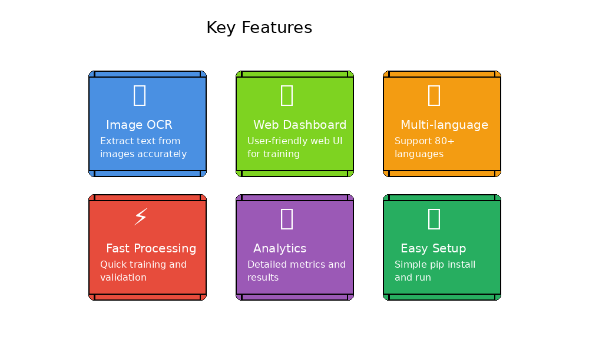
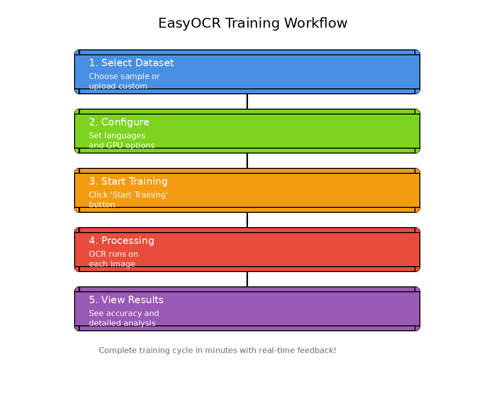
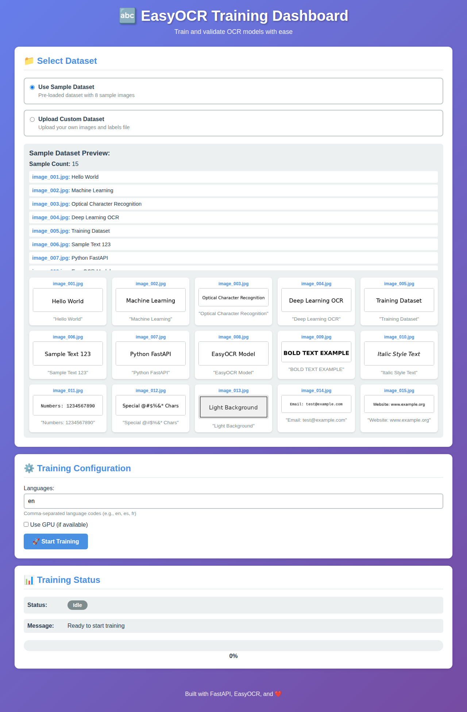
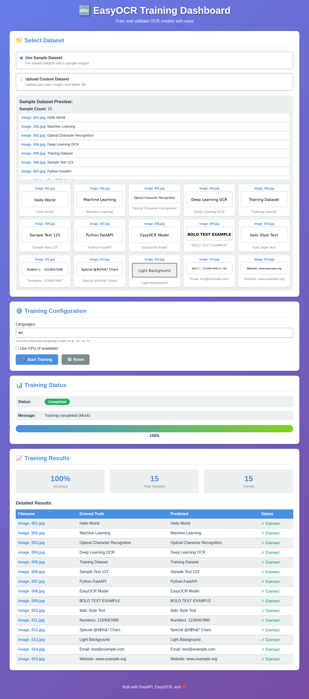
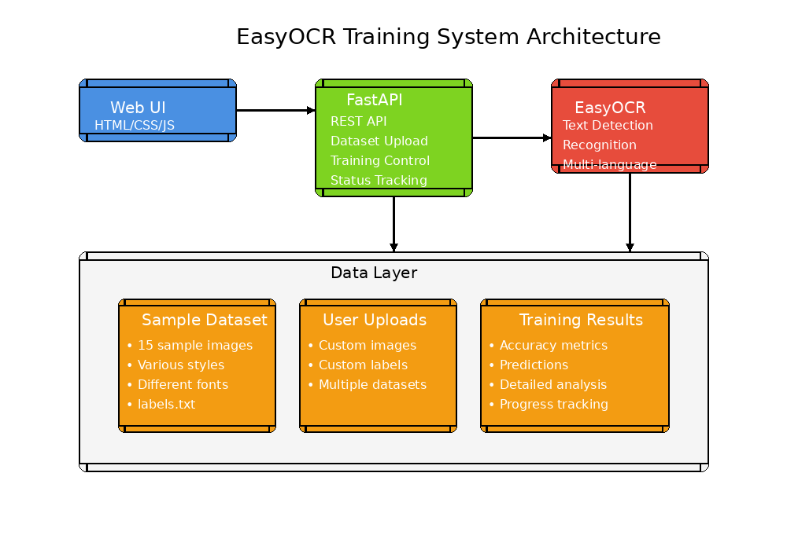

# EasyOCR Image-to-Text Model

This project implements an OCR (Optical Character Recognition) model using the EasyOCR approach to convert images containing text into machine-readable text.



## Features

- 🖼️ Convert images to text using state-of-the-art EasyOCR
- 📝 Extract text with confidence scores
- 🎯 Draw bounding boxes around detected text
- 🌍 Support for multiple languages
- 🚀 Easy-to-use API
- 💻 Works with both CPU and GPU
- 🌐 **NEW: FastAPI Web UI for OCR Training**
- 📊 **Interactive Training Dashboard**
- 🎨 **Visual Sample Gallery with 15 Diverse Examples**

## Installation

1. Clone this repository:
```bash
git clone https://github.com/ali2943/EasyOCR-model-training.git
cd EasyOCR-model-training
```

2. Install the required dependencies:
```bash
pip install -r requirements.txt
```

## Quick Start

### Visual Workflow



### Option 1: FastAPI Web UI (Recommended)

Launch the web-based training dashboard:

```bash
python -m uvicorn app.main:app --reload --host 0.0.0.0 --port 8000
```

Then open your browser and navigate to:
```
http://localhost:8000
```

#### Web UI Screenshots

**Main Dashboard with Sample Image Gallery:**



**Training Results with Detailed Metrics:**



The web UI allows you to:
- 🖼️ **Browse Sample Images**: View a visual gallery of 15 diverse sample images
- 📁 Select or upload OCR training datasets
- ⚙️ Configure training parameters
- 🚀 Start training/validation jobs
- 📊 View real-time training progress
- 📈 Analyze training results with detailed metrics

### Option 2: Command Line Usage

#### Generate a Sample Image
```bash
python generate_sample_image.py
```

#### Run the Demo
```bash
python demo.py sample_images/sample_text.jpg
```

### Use in Your Code

```python
from src.easy_ocr_model import EasyOCRModel

# Initialize the model
model = EasyOCRModel(languages=['en'], gpu=False)

# Read text from an image
results = model.read_image('path/to/your/image.jpg')

# Get only the text
text_list = model.extract_text_only('path/to/your/image.jpg')

# Get concatenated text
full_text = model.get_full_text('path/to/your/image.jpg')

# Get text with confidence scores
text_with_conf = model.get_text_with_confidence('path/to/your/image.jpg')

# Draw bounding boxes and save
model.draw_bounding_boxes('path/to/image.jpg', 'output/annotated.jpg')
```

## API Reference

### EasyOCRModel

Main class for performing OCR on images.

#### `__init__(languages=['en'], gpu=False)`
Initialize the EasyOCR model.
- **languages**: List of language codes (default: ['en'])
- **gpu**: Whether to use GPU (default: False)

#### `read_image(image_path)`
Read text from an image file.
- **Returns**: List of tuples (bounding_box, text, confidence)

#### `extract_text_only(image_path)`
Extract only the text content.
- **Returns**: List of text strings

#### `get_full_text(image_path, separator=' ')`
Get all text as a single concatenated string.
- **Returns**: Full text string

#### `get_text_with_confidence(image_path)`
Get text with confidence scores.
- **Returns**: List of tuples (text, confidence)

#### `draw_bounding_boxes(image_path, output_path=None)`
Draw bounding boxes on detected text regions.
- **Returns**: Annotated image array

## Supported Languages

EasyOCR supports 80+ languages. Common ones include:
- English (`en`)
- Chinese (`ch_sim`, `ch_tra`)
- Spanish (`es`)
- French (`fr`)
- German (`de`)
- Japanese (`ja`)
- Korean (`ko`)
- And many more...

To use multiple languages:
```python
model = EasyOCRModel(languages=['en', 'fr', 'de'], gpu=False)
```

## Project Structure



```
EasyOCR-model-training/
├── app/
│   ├── main.py                 # FastAPI application entrypoint
│   └── static/                 # Web UI assets
│       ├── index.html          # Main UI page
│       ├── style.css           # Styling
│       └── script.js           # JavaScript for UI interactions
├── data/
│   ├── sample_dataset/         # Sample OCR training dataset
│   │   ├── image_001.jpg       # Sample training images (15 total)
│   │   ├── labels.txt          # Ground truth labels
│   │   ├── create_dataset.py   # Script to regenerate dataset
│   │   └── README.md           # Dataset documentation
│   └── uploads/                # Directory for user-uploaded datasets
├── docs/
│   ├── images/                 # Documentation images and diagrams
│   │   ├── architecture.png    # System architecture diagram
│   │   ├── workflow.png        # Training workflow diagram
│   │   └── features.png        # Features showcase
│   └── generate_diagrams.py    # Script to generate diagrams
├── src/
│   ├── __init__.py             # Package initialization
│   └── easy_ocr_model.py       # Main OCR model implementation
├── tests/
│   └── test_easy_ocr_model.py  # Unit tests
├── sample_images/               # Sample images for testing
│   └── sample_text.jpg         # Generated test image
├── output/                      # Output directory for annotated images
├── demo.py                      # Demo script
├── examples.py                  # Code examples
├── generate_sample_image.py    # Script to generate test images
├── requirements.txt             # Python dependencies
├── .gitignore                   # Git ignore file
└── README.md                    # This file
```

## FastAPI Web Application

### Starting the Web Server

To start the FastAPI web application:

```bash
# Using uvicorn directly
uvicorn app.main:app --reload --host 0.0.0.0 --port 8000

# Or using Python module syntax
python -m uvicorn app.main:app --reload --host 0.0.0.0 --port 8000

# For production (without --reload)
uvicorn app.main:app --host 0.0.0.0 --port 8000
```

The server will start at `http://localhost:8000`

### API Endpoints

The FastAPI application provides the following endpoints:

#### Web UI
- `GET /` - Main web UI dashboard

#### API Endpoints
- `GET /api/health` - Health check endpoint
- `GET /api/datasets` - List available datasets
- `GET /api/sample-dataset` - Get sample dataset information
- `POST /api/upload` - Upload a custom dataset (images + labels.txt)
- `POST /api/train` - Start a training/validation job
- `GET /api/status` - Get current training status
- `POST /api/reset` - Reset training state

### Using the Web UI

1. **Select Dataset**: Choose between the pre-loaded sample dataset or upload your own
2. **Configure Training**: Set language preferences and GPU usage
3. **Start Training**: Click "Start Training" to begin the validation process
4. **Monitor Progress**: View real-time status updates and progress
5. **View Results**: Analyze accuracy metrics and detailed predictions

### Sample Dataset

The repository includes a comprehensive sample dataset in `data/sample_dataset/` with:
- **15 diverse sample images** (image_001.jpg through image_015.jpg)
- Various text styles: regular, bold, italic, monospaced
- Different content types: text, numbers, special characters, emails, URLs
- labels.txt file with ground truth text for each image
- Format: `filename<TAB>text`

#### Sample Dataset Examples:
- 📝 Regular text: "Hello World", "Machine Learning"
- 🔤 Bold text: "BOLD TEXT EXAMPLE"
- ✍️ Italic text: "Italic Style Text"
- 🔢 Numbers: "Numbers: 1234567890"
- 💬 Special characters: "Special @#$%&* Chars"
- 📧 Email format: "Email: test@example.com"
- 🌐 URL format: "Website: www.example.org"

The web UI displays these images in an interactive gallery with visual previews!

Example `labels.txt` entry:
```
image_001.jpg	Hello World
image_002.jpg	Machine Learning
```

To regenerate the sample dataset:
```bash
cd data/sample_dataset
python create_dataset.py
```

For more information about the dataset format, see `data/sample_dataset/README.md`

### Uploading Custom Datasets

To use your own dataset:

1. Prepare your images (JPG, PNG formats)
2. Create a `labels.txt` file with the format: `filename<TAB>text`
3. Use the web UI upload feature or the API endpoint
4. Select your uploaded dataset and start training

## Requirements

- Python 3.7+
- easyocr >= 1.6.2
- opencv-python >= 4.5.0
- pillow >= 9.0.0
- numpy >= 1.21.0
- torch >= 1.9.0
- torchvision >= 0.10.0
- fastapi >= 0.104.0
- uvicorn >= 0.24.0
- python-multipart >= 0.0.6

## How It Works

The EasyOCR approach uses deep learning models to:
1. **Detect** text regions in the image
2. **Recognize** the text in each region
3. **Return** the text with bounding boxes and confidence scores

This implementation wraps the EasyOCR library to provide a simple, easy-to-use interface for common OCR tasks.

## Examples

### Example 1: Basic Text Extraction
```python
model = EasyOCRModel()
text = model.get_full_text('invoice.jpg')
print(text)
```

### Example 2: Multi-language OCR
```python
model = EasyOCRModel(languages=['en', 'es'])
results = model.read_image('multilingual_document.jpg')
for bbox, text, conf in results:
    print(f"{text} (confidence: {conf:.2f})")
```

### Example 3: Processing with Confidence Threshold
```python
model = EasyOCRModel()
results = model.get_text_with_confidence('image.jpg')
filtered = [text for text, conf in results if conf > 0.5]
print(filtered)
```

## Contributing

Contributions are welcome! Feel free to submit issues or pull requests.

## License

This project is open source and available under the MIT License.

## Acknowledgments

- Built with [EasyOCR](https://github.com/JaidedAI/EasyOCR)
- Uses PyTorch for deep learning
- OpenCV for image processing
